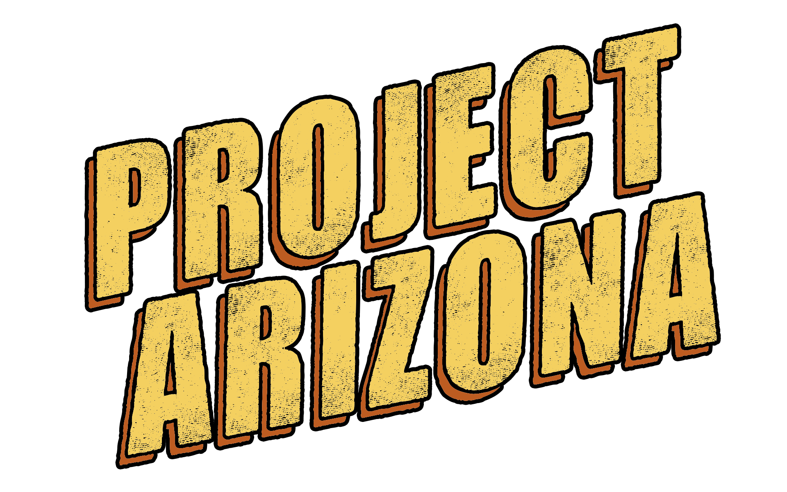
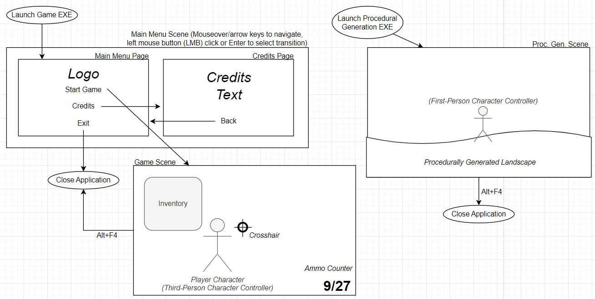
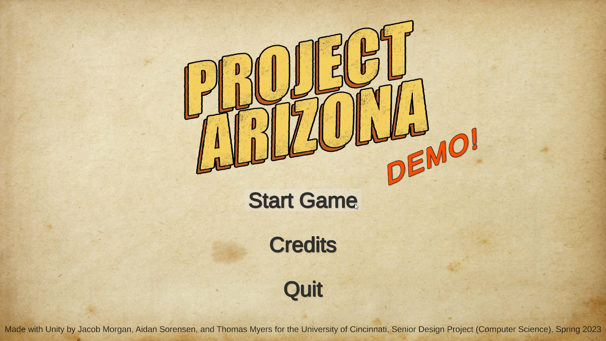
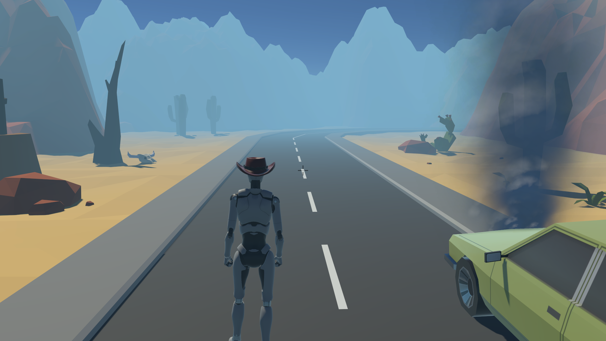
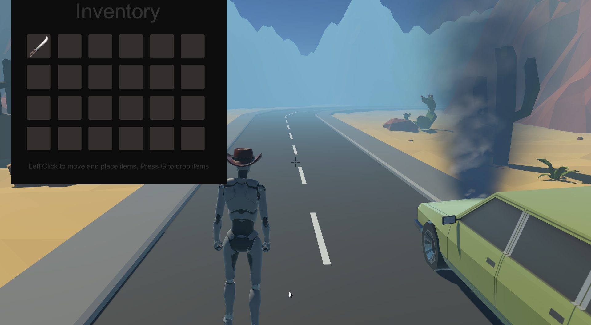
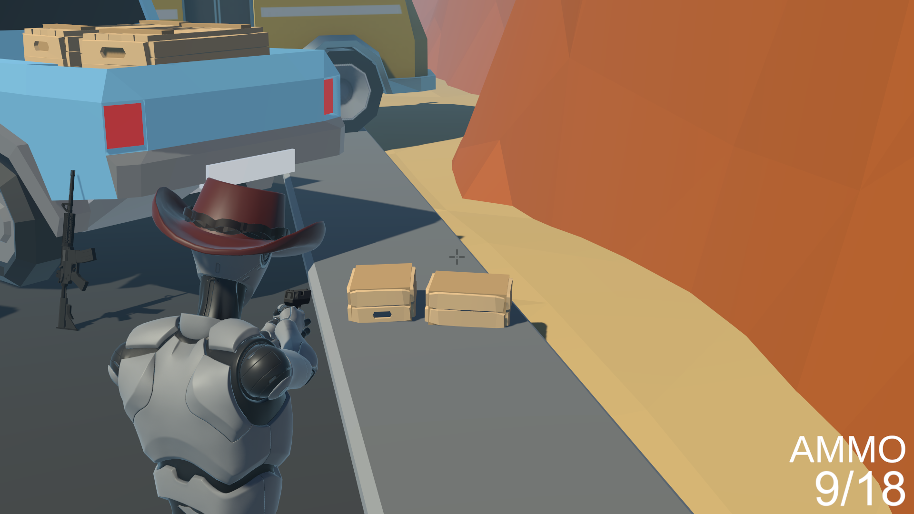

# Team "QWERTY Committee" CS5002 Final Design Report:
#### Team Members: Aidan Sorensen, Jacob Morgan, Thomas Myers | Faculty Project Advisor: Jillian Aurisano

## Quick Links:
- #### [Latest Release](https://github.com/Jmorgan97/QWERTY-Committee/releases/latest)
- #### [User Guide](https://github.com/Jmorgan97/QWERTY-Committee/blob/main/User%20Docs/User_Guide.md)
- #### [Game Manual](https://github.com/Jmorgan97/QWERTY-Committee/blob/main/User%20Docs/Game_Manual.md)
- #### ["Project Arizona" Game Direct Download Link (Google Drive download)](https://drive.google.com/drive/folders/1saYWJ75qpd3Hc11MAecrOlUImRgxWKvo?usp=sharing)
	> ##### The game had individual files too big for a GitHub repo, so we've opted to store the unzipped build in Google Drive for downloading, about 280MB tops.
- #### [Repo for the Procedural Generation portion of the project](https://github.com/Myers747/Project-Arizona-Procedural-Generation)
- #### [All Unity project script files](https://github.com/Jmorgan97/QWERTY-Committee/tree/main/Scripts)

---

## Table of Contents:
- #### 1. [Project Abstract](#abstract) and [Description](#description)
- #### 2. [User Interface Specification](#ui)
- #### 3. [Test Plan and Results](#test)
- #### 4. [User Guide and Game Manual](#manual)
- #### 5. [Spring Final Slideshow Presentation](#slides)
- #### 6. [Final Expo Poster](#poster)
- #### 7. [Assessments](#assessments)
	- ##### 7.1. [Initial Self-Assessments (fall)](#fall)
	- ##### 7.2. [Final Self-Assessments (spring)](#spring)
- #### 8. [Summary of Hours and Justification](#hours)
- #### 9. [Summary of Expenses](#expenses)
- #### 10. [Appendix](#appendix)
- #### 11. [Credits](#credits)

---

### 1. Abstract: 
> "Project Arizona" is a Unity game showcasing the skills we’ve learned from our time here at the University of Cincinnati as CS majors, engineers, and software designers. The limited demo sandbox includes core gameplay mechanics in the base game that we developed to display our understandings of data structures, computer architecture, graphics, software testing/QA, and other technical disciplines.

### 1.(cont.) "Project Arizona" Description: 
> Project Arizona started as an idea for a 3D action/adventure/survival game set in a fictional post-apocalyptic American wasteland. The game is played through a third-person camera perspective. Our goal was to develop a limited, but complete demonstrational experience in which the player can get a feel for the setting of the game, familiarize themselves with the controls, and experience all of the major, basic character controller functions of the game, like exploration and looting, within a confined sandbox experience. We envisioned something similar to the opening cinematic and tutorial of a fully-fledged game, but with the ability to play around and see what a more complete, broader scope game might offer through a typical demo or trial version of those games.

---

### 2. User Interface Specification: 
- #### App Flow and UI Diagram (basic navigation of game and proc. gen. apps):

- #### Screenshots:
> ##### Main Menu Scene

> ##### Game Scenes

> ##### Procedural Generation Scene

---

### 3. Test Plan and Results: 
- #### [Initial Test Plan Document](https://github.com/Jmorgan97/QWERTY-Committee/blob/main/TestPlan.pdf)
> We ultimately did not follow our ideal, original test plan submission due to our project being in production up until the day of the expo, so testing was done actively, cyclicly throughout development by all team members. Due to the nature of game development and the way we worked in Unity's editor, testing contiunously, cyclicly throughout development was the best methodology for testing every small change or implementation for our project. We were unable to get outsiders to test our game before the expo, but some expo guests who visited our booth did test the app and find bugs for us in playtesting and demoing the build.

---

### 4. User Guide and Game Manual: 
- #### [User Guide](https://github.com/Jmorgan97/QWERTY-Committee/blob/main/User%20Docs/User_Guide.md)
- #### [Game Manual](https://github.com/Jmorgan97/QWERTY-Committee/blob/main/User%20Docs/Game_Manual.md)

---

### 5. Spring Final Slideshow Presentation: 
- #### [Google Slides](https://docs.google.com/presentation/d/1gHlmadPL_s-FE6YGnVkt1e0DPgESmbefmdNsu120KyI/edit?usp=sharing)
- #### [YouTube Video](https://www.youtube.com/watch?v=suR1-ARk1ks)

---

### 6. Final Expo Poster: 
> ##### Our final expo poster pdf would not fit on GitHub, but the full-size, high-def PDF was submitted on Canvas. It can be found [here](https://drive.google.com/file/d/1r0XumtdIQbPm8yNdU5a7aUzjilrL8ScD/view?usp=sharing) on Google Drive. It is presented here as a JPG:

---

### 7. Assessments: 
- #### 7.1. [Initial Self-Assessments](https://github.com/Jmorgan97/QWERTY-Committee/tree/main/Self-Assessment_Essays)
- #### 7.2. [Final Self-Assessments](https://github.com/Jmorgan97/QWERTY-Committee/tree/main/Self-Assessment_Essays/Final_Self-Assessment_Essays)

---

### 8. Summary of Hours and Justification: 
#### Aidan Sorensen:
- ##### Fall Semester:
|Task|Description|Hours|Percent|
|----|-----------|-----|-------|
|Team Meetings|Meetings with team to discuss and decide on project specifics|25 hrs|50%|
|Advisor Meetings|Weekly meetings with faculty advisor|5 hrs|~5%|
|Assignments|Working on Senior Design semester assignments|5 hrs|~5%|
|Learning|Researching relevant material to prepare for project work in 2nd semester|20 hrs|~40%|
|**Total**||**55 hrs**|**100%**|

- ##### Spring Semester:
|Task|Description|Hours|Percent|
|----|-----------|-----|-------|
|Assignments|Senior Design II semester assignments|5 hrs|~5%|
|Learning|Learning Unity via tutorials and smaller projects|15 hrs|~20%|
|Main development|Main Unity Project Development|25 hrs|~30%|
|Integration|Combining our 3 parts and developing alongside teammates|15 hrs | ~20%|
|Week before Expo|Expo Week preparation and final development|20 hrs|25%|
|**Total**||**80 hrs**|**100%**|

- ##### Aidan's Justification
> ##### Fall Semester: Our team met weekly. We often collaborated for over an hour during our weekly meetings. We also met weekly with our advisor starting about halfway through the fall sem, and these lasted from 15mins - 1 hr. After our weekly meetings, I would do some research and learn Unity for usually an hour or so until I took a break.
> ##### Spring Semester: At the beginning of the spring semester, we were working slowly and classes took most of our time. I also had some issues with my computer and had to completely reinstall my operating system(probably because I was triple booting Windows, linux, and a cracked MacOS lolol). Most of the Unity Development I did took place before the final week before the Expo, but due to our split progress, a LOT of time was spent combining our development into one Unity Project. This took up a lot of time mostly because we were using different input systems, which should've been avoided but it just never occurred to me that we might be setting things up with legacy/new systems. Something to remember for future projects. Regardless, the final push before the senior project revolved around us as a team sitting in Discord working for like 3 days straight fixing our build errors.  

#### Jacob Morgan:
- ##### Fall Semester:
|Task|Description|Hours|Percent|
|----|-----------|-----|-------|
|Team Meetings|Meetings with team to discuss and decide on project specifics|25 hrs|50%|
|Advisor Meetings|Weekly meetings with faculty advisor|5 hrs|10%|
|Assignments|Working on Senior Design semester assignments|10 hrs|20%|
|Learning|Researching relevant material to prepare for project work in 2nd semester|10 hrs|20%|
|**Total**||**~50 hrs**|**100%**|

- ##### Spring Semester:
|Task|Description|Hours|Percent|
|----|-----------|-----|-------|
|Team Meetings|Check-in meetings with team to discuss progress and next steps|10 hrs|11%|
|Assignments|Working on Senior Design semester assignments|10 hrs|11%|
|Learning|Work following alongside Unity tutorials and GoogleFu/StackO troubleshooting|15 hrs|17%|
|General Unity Editing|Writing scripts, testing, tweaking animations, troubleshooting, building world, implementing features and assets|25 hrs|28%|
|Finding Assets|Scouring Unity Asset Store, Mixamo, Sketchfab, Google, etc. for visual assets and editing audio clips|5 hrs | 5%|
|Expo Week Crunch|Long hours skipping classes together to catch up on project|10 hrs|11%|
|Expo Eve Crunch|Staying up all day and night before Expo on Discord to finish project together|15 hrs|17%|
|**Total**||**~90 hrs**|**100%**|

- ##### Jacob's Justification:
> ##### For the fall semester, our team met at least twice a week for an average of 2.5hrs a week over 10 weeks, as well as meeting with our advisor for an average of at least 30 minutes over 10 weeks. I spent roughly 10hrs in total preparing and setting up documents, updating our GitHub repo, and filling out assignment information for our team. Our advisor encouraged us to try and spend 15 minutes to an hour at least once a week trying to read, learn, or practice something related to our game, which I contributed about 10hrs to doing.
> ##### For the spring semester, I tried to work on our project at least once a week. I found that on average I would sit down at my computer and get sucked into editing in Unity in 4hr chunks after class, sometimes less, but more often I'd spend much longer than that on weekends, dedicating half a day or so. At one point past the middle of the semester I had issues with my personal desktop requiring a clean Windows installation that slowed down my work progress. About a week after this change, a problem with Windows 11 caused me to lose all of project files and I had to restore my work from a backup, losing an entire week's worth of progress. A great chunk of the hours I spent on this project were after this time, especially in the final week before the expo, as I tried to recreate, rebuild, and improve upon my work while trying to catch up to our goals.

#### Thomas Myers:
- ##### Fall Semester:
|Task|Description|Hours|Percent|
|----|-----------|-----|-------|
|Team Meetings|Meetings with team to discuss and decide on project specifics|x hrs|x%|
|Advisor Meetings|Weekly meetings with faculty advisor|x hrs|x%|
|Assignments|Working on Senior Design semester assignments|x hrs|x%|
|Learning|Researching relevant material to prepare for project work in 2nd semester|x hrs|x%|
|**Total**||**xx hrs**|**100%**|

- ##### Spring Semester:
|Task|Description|Hours|Percent|
|----|-----------|-----|-------|
|task1|x hrs|x%|
|task2|x hrs|x%|
|**Total**||**xx hrs**|**100%**|

- ##### Justification:
> ##### Justification Paragraph

#### Team Totals:
|Team Member|Hours Committed|Percent Contributed|
|-----------|---------------|-------------------|
|Aidan Sorensen|000 hrs|00%|
|Jacob Morgan|000 hrs|00%|
|Thomas Myers|000 hrs|00%|

- ##### Team Justification:
> ##### Team Justification Paragraph

---

### 9. Summary of Expenses: 
> We spent $0 in developing this game as Unity is a free game development engine, we used freely available community or public assets, and we did not release our game for an official, published release for profit. The game was developed on our own personal computers with Unity, Visual Studio, Photoshop, and Audacity. For the expo, we did spend money on supplies for our booth, including $8 for hand sanitizer, $25 for a Logitech MK235 mouse and keyboard combo, and $10 on mousepads, for a total of roughly $47 after tax. We additionally brought our laptops, cables, power/adapters, peripherals, and monitors to best present our work at the expo.

---

### 10. Appendix (outdated assignment submissions and other info): 
- #### [Individual game C# code scripts](https://github.com/Jmorgan97/QWERTY-Committee/tree/main/Scripts)

- #### [User_Stories](https://github.com/Jmorgan97/QWERTY-Committee/blob/main/User_Stories.md "User_Stories.md")
- #### [Initial Design Diagrams](/Design_Diagrams//Design_Diagram.png?raw=true "Design Diagrams")
	- #### [Description](/Design_Diagrams//Design_Diagrams.md)

- #### Initial Project Tasks and Timeline
	- #### [Tasklist](https://github.com/Jmorgan97/QWERTY-Committee/blob/main/Tasklist.md "Tasklist.md")
	- #### [Milestones, Timeline, & Effort-Matrix](https://github.com/Jmorgan97/QWERTY-Committee/blob/main/Milestones_Timeline_%26_Effort-Matrix.md "Milestones_Timeline_&_Effort-Matrix.md")

- #### [Initial Project Constraints](https://github.com/Jmorgan97/QWERTY-Committee/blob/main/Project_Constraints.md "Project_Constraints.md")

- #### Initial Budget:
> ##### "Our budget for this game was $0. We spared no expense in acquiring assets and used only freely available modeling and animation assets from Unity's own Asset Store, Mixamo (Adobe), Sketchfab, and other similar resources. We also used sound effects from Valve's Source engine games as placeholders."

- #### [Initial Professional Biographies](https://github.com/Jmorgan97/QWERTY-Committee/tree/main/Professional_Biographies)

---

### 11. Credits
- #### Bearcats statue model: "Binturongs (NHMW-Zoo-MAMM ST525)" (https://skfb.ly/o7JXW) by Natural History Museum Vienna is licensed under Creative Commons Attribution-NonCommercial (http://creativecommons.org/licenses/by-nc/4.0/).
- #### Placeholder Sound Effects from Valve's Counter-Strike: Source and Half-Life 2 or other common Source engine game assets.
- #### Made in Unity 2021.3.10f1 and built off of Unity's own "Starter Assets - Third Person Character Controller" project template and asset store pack
- #### Unity Asset Store Packages Used:
	- ##### "Effect textures and prefabs" by Magicpot Inc.
	- ##### "Ez Tornado" by Elix Inc.
	- ##### "Free Low Poly Desert Pack" by 23 Space Robots and Counting...
	- ##### "Hats pack..." by Unity Technologies Inc.
	- ##### "Hit Impact Effects FREE" by Travis Game Assets
	- ##### "Low Poly Cars, Cliff Pack, and Road Pack" by Broken Vector
	- ##### "Low Poly Crates" by PULSAR BYTES
	- ##### "Low Poly Environment Pack" by k0rveen
	- ##### "Low Poly FPS Weapons Lite" by JustCreate
	- ##### "Machete01" by Nikolay Fedorov
	- ##### "Simple Cars Pack" by MyxerMan
	- ##### "Simple Street Props" by AiKodex
	- ##### "Survival Kit Lite" by Rowntec Assets
	- ##### "War FX" by Jean Moreno
	- ##### "Military target" by NikiYani
- #### And various animations from Mixamo (Adobe)
- #### Inspired by the great folks behind games like Fallout: New Vegas, Minecraft, Stardew Valley, The Last of Us, Valheim, Outer Wilds, Disco Elysium, and too many more to name.
