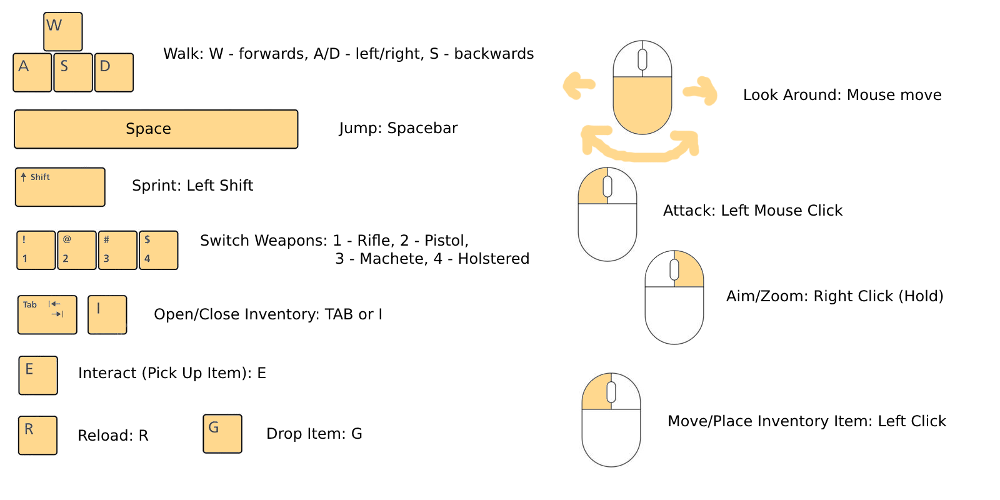

# Project Arizona - Game Manual

## Table of Contents
- ### [1. Info](#info)
- ### [2. Controls](#controls)
- ### [3. Gameplay](#gameplay)
- ### [4. Frequently Asked Questions (FAQs)](#faq)

## 1. Info: 
Project Arizona is a third-person action adventure game created in the Unity game development engine by computer science students Jacob Morgan, Aidan Sorensen, and Thomas Myers at the University of Cincinnati for their senior design project. The game is free to download, install, and play in its limited demo sandbox form. Set in a fictional, modern day world in which the advancement of the world climate crisis effectively creates a post-apocalyptic wasteland in the American Southwest, the player character finds themselves stranded in the desert on a rocky highway path with their car broken down as a sandstorm approaches. The player can explore the area, gear up, get acclimated with their equipment, manage their invoentory, shoot, and practice aiming.

## 2. Controls: 
### Default Controls:
- ### Mouse and Keyboard
	- Look Around - [Mouse Move]
	- Walk - [W/A/S/D Cluster (Forward/Left/Back/Right)]
	- Attack/Shoot - [Left Mouse Button Click]:(Press for single attack)
	- Aim Down Sights/Zoom - [Right Mouse Button Click]:(Hold)
	- Sprint - [Left Shift]:(Hold)
	- Jump - [Space Bar]
	- Reload Firearms - [R]
	- Interact (Pick Up Item) - [E]
	- Open Inventory - [Tab] or [I]
	- Navigate Menus - [Mouse Cursor]
	- Pick Up and Move/Place Item in Inventory Slot - [Left Mouse Button Click]
	- Drop Item from Inventory at Feet - [G] (while hovering mouse cursor over item in inventory)
	- Switch to Rifle (when eqipped) - [1]
	- Switch to Pistol (when eqipped) - [2]
	- Switch to Machete - [3]
	- Switch to Holstered - [4]

## 3. Gameplay: 
The game can be played once it has been downloaded from the GitHub repository. See the main page https://github.com/Jmorgan97/QWERTY-Committee for more info.
Once downloaded, launch the "Project Arizona.exe" file. You should be presented with a "Made with Unity" splash screen before arriving at the main menu. From the main menu, you can start the game, view the credits, or exit and close the game. Once playing the game, you can close it with ALT+F4 if in fullscreen and no X button or window bar is available. You can walk around the area with free motion and your character will turn and walk towards the direction you make them relative to the WASD keys and the direction you aim the camera with your mouse. While aiming (holding right mouse), your character will always face towards where you aim with the crosshair and instead strafe or backpedal instead of turning left or right relative to the camera. You start spawned with your weapon holstered (4 to switch back to holstered) and a machete (press 3 to switch to machete). You can use the weapons to break down cacti in the area, each taking a different number of hits based on their size. Down the road, there are firearms that you pick up when you walk close to them and press E when prompted. Walking over ammo will automatically pick it up. You can also pick up apples. You can manage your inventory be accessing it with the TAB or I keys, then click and move around items with left click. You can drop an item by pressing G while hovering hovering over it with your cursor in the inventory. At the end of the area, in the cubic style portion, there is a firing range target to the left which you can train your aming with by shooting it. It will move to a random position in the area upon being hit. Many of the mountains in the area have invisible walls to prevent you from travelling out of bounds, but there is one gap in them in which we have hidden a Bearcat easter egg ;)

## 4. FAQs: 
- *Are there any bugs?*
-- Sometimes animations mess up while going between switching weapons and aiming or maneuvering too quickly. The rifle seems to not respect the magazine size limit. There are areas and ways to get out of bounds in the final area as well as some parts of the mountains. Dropping weapons from your inventory does not unequip them or take away your ability to switch to them once you have picked them up once. Pressing E while not near an item to pick up will queue your interaction and allow you to pick them up immediately when in range, without a prompt.

- *How was this game made?*
-- Project Arizona was developed using Unity; a robust, free-to-use game development engine and platform. Unity uses C# as its base programming language. The game was developed by Jacob Morgan, Aidan Sorensen, and Thomas Myers -- computer science students at the University of Cincinnati between Fall 2022 and Spring 2023.

- *Where can I reach out for questions, get technical support, or learn more about Project Arizona?*
-- You can visit the team's [main GitHub repository page](https://github.com/Jmorgan97/QWERTY-Committee) or [contact us](https://github.com/Jmorgan97/QWERTY-Committee/blob/main/User%20Docs/User_Guide.md#contactus)! 
